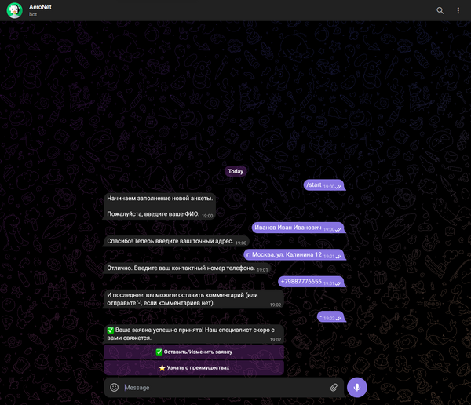

<h1 align="center">AeroNet</h1>

<p align="center">
  Asynchronous Telegram bot for telecommunications and internet service providers to collect, validate and sync customer connection applications
</p>

<p align="center">
  <a href="LICENSE">
    
  </a>
  
  
  
  
</p>

<p align="center">
  
</p>

<p align="center">
  <sub>Application questionnaire flow with validation, tariff selection and inline navigation</sub>
</p>

## About

AeroNet is an asynchronous Telegram bot built for internet service providers and telecom operators. It guides prospective subscribers through a step-by-step application workflow, validates contact information, offers interactive tariff selection, and synchronizes submitted records directly to Google Sheets with local SQLite persistence.

## Features

* Step-by-step application workflow (FSM) covering customer name, address, phone number, tariff, and optional comments
* Input validation for phone numbers (standardized to Russian/international format) with support for Telegram native contact sharing
* Interactive catalog of internet plans and tariff selection during questionnaire
* Real-time synchronization to Google Sheets with automated column formatting and frozen headers
* Failsafe local SQLite database ensuring applications are stored immediately even if Google services or network connections are temporarily offline
* Automated background sync worker that flushes pending local records to Google Sheets
* Application review and field editing via `/my_application`
* Optional instant admin alerts in Telegram when new applications arrive

## Project Structure

```text
aeronet/
├── main.py                  # Bot entry point, polling runner and lifecycle tasks
├── aeronet_core/            # Core library package
│   ├── config.py            # Environment configuration, tariffs, provider info
│   ├── database.py          # Local SQLite storage (failsafe application buffer)
│   ├── handlers.py          # Telegram command and conversation handlers
│   ├── keyboards.py         # Inline menus, tariff selection, contact sharing
│   ├── models.py            # ApplicationData and Tariff dataclasses
│   ├── sheets.py            # Async Google Sheets client and retry logic
│   └── validation.py        # Phone normalizer, FIO and address sanitizers
├── docs/screenshots/        # Documentation assets
├── tests/                   # Automated unit tests
│   ├── test_database.py
│   └── test_validation.py
├── requirements.txt         # Project dependencies
├── .env.example             # Template for environment configuration
├── .gitignore
├── LICENSE
└── README.md
```

## Requirements

* Python 3.10 or newer
* A Telegram bot token from [@BotFather](https://t.me/BotFather)
* A Google Cloud service account JSON key with Google Sheets API and Google Drive API enabled

## Setup and Running

### 1. Clone the repository

```bash
git clone https://github.com/DamianEhrenburg/aeronet.git
cd aeronet
```

### 2. Set up virtual environment

```bash
python -m venv .venv

# Windows:
.venv\Scripts\activate

# Linux / macOS:
source .venv/bin/activate
```

### 3. Install dependencies

```bash
pip install -r requirements.txt
```

### 4. Configure Google Sheets access

1. Create a service account in the [Google Cloud Console](https://console.cloud.google.com/) with Google Sheets and Google Drive APIs enabled.
2. Download the service account JSON key file and place it in the project directory as `credentials.json`.
3. Create a Google Spreadsheet and share it with the service account email (`client_email` from the JSON file) with **Editor** permissions.

### 5. Configure environment variables

Create a `.env` file based on `.env.example`:

```bash
cp .env.example .env
```

Fill in your configuration:

```env
TELEGRAM_BOT_TOKEN=your_telegram_bot_token_here
GOOGLE_SHEET_URL=https://docs.google.com/spreadsheets/d/your_spreadsheet_id/edit
PROVIDER_NAME=AeroNet
CREDENTIALS_FILE=credentials.json
ADMIN_CHAT_ID=your_telegram_chat_id_optional
```

### 6. Run tests

```bash
python -m pytest
```

### 7. Start the bot

```bash
python main.py
```

## Privacy and Storage

* Connection applications are stored locally in an SQLite database (`aeronet.db`) and forwarded to the configured Google Spreadsheet.
* Service account keys and `.env` configuration are excluded from source control.
* Data is transmitted securely over HTTPS via the official Telegram and Google APIs.

## Русский

<details>
<summary>Описание на русском языке</summary>

AeroNet — асинхронный Telegram-бот для телеком-операторов и интернет-провайдеров, автоматизирующий сбор и обработку заявок на подключение абонентов.

Бот проводит пользователя по шагам анкеты, валидирует номер телефона и адрес, позволяет выбрать тарифный план и сохраняет заявку одновременно в локальную базу данных SQLite и в Google Таблицу.

### Возможности

* пошаговый диалог сбора заявки (ФИО, адрес, телефон, тариф, комментарии);
* нормализация телефонных номеров и поддержка нативной отправки контакта кнопкой;
* каталог тарифов с описаниями и выбором прямо в анкете;
* асинхронная синхронизация с Google Sheets без блокировки событий бота;
* локальная база SQLite для гарантированной сохранности данных при сбоях сети или API;
* фоновый процесс досылки неотправленных заявок в таблицу;
* просмотр и редактирование поданной заявки по команде `/my_application`;
* опциональные уведомления администратора в Telegram о новых заявках.

### Установка и запуск

```bash
git clone https://github.com/DamianEhrenburg/aeronet.git
cd aeronet
python -m venv .venv
.venv\Scripts\activate
pip install -r requirements.txt
```

Создайте `.env` на основе `.env.example`, укажите токен бота, ссылку на таблицу и путь к сервисному ключу Google Cloud (`credentials.json`), после чего запустите:

```bash
python main.py
```

</details>

## License

AeroNet is distributed under the [MIT License](LICENSE).
